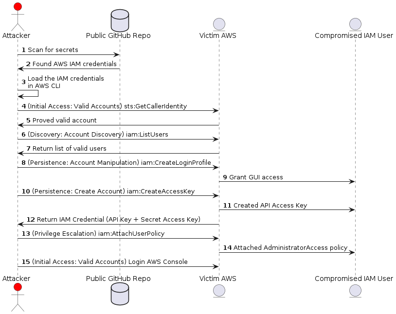
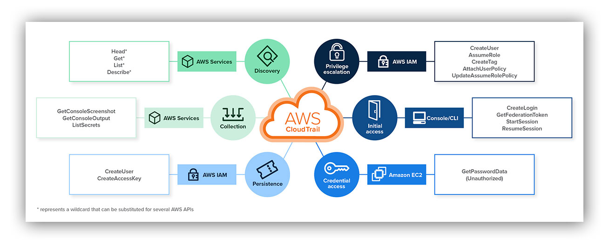

# 2022-04-17_IAMCompromise

## Attack Sequence

  

## Detection Opportunities

### Exposed credentials

1. Secret scanning
2. (Active Defense) Inventory IAM Access Key, and actively scanning public repos for them

### Suspicious IAM Activities

1. (SIEM Use Case) Detect IAM activities from uncommon locations
2. (SIEM Use Case) Detect IAM User `ConsoleLogin` without MFA
3. (SIEM Use Case) Detect IAM User `ConsoleLogin` from uncommon locations
4. (SIEM Use Case) Detect sensitive IAM policy attachment (e.g. `AdministratorAccess`)
5. (SIEM Use Case) Detect IAM User or Access Key Creation (`iam:CreateUser` / `iam:CreateLoginProfile` / `iam:UpdateLoginProfile` / `iam:CreateAccessKey`)
6. (SIEM Use Case) Detect `RequestServiceQuotaIncrease` for potential impact

## Reference

### Expel.io Blog

[Incident report: From CLI to console, chasing an attacker in AWS](https://expel.com/blog/incident-report-from-cli-to-console-chasing-an-attacker-in-aws/)

### Expel.io AWS Mindmap

  
