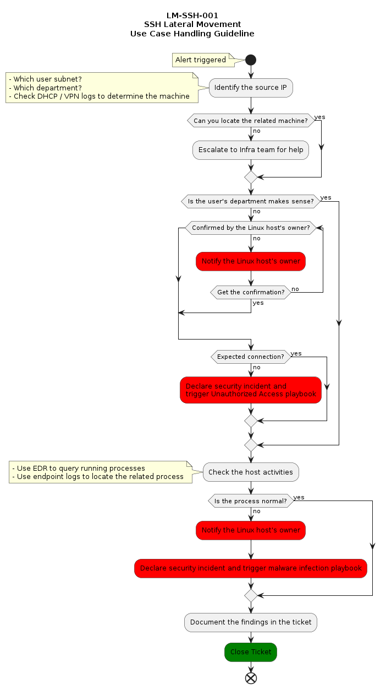

# LM-SSH-001: SSH Lateral Movement

## Metadata

| **Use Cases Metadata** ||
| --- | --- |
| **UUID** | b5479944-0dcf-4ac8-87d0-184951a96f56 |
| **Name** | SSH Lateral Movement |
| **Short Name** | LM-SSH-001 |
| **Author** | James |
| **Kill Chain** | Exploitation |
| **ATT&CK** | (T1021.004) Lateral Movement - Remote Services: SSH |
| **References** | - [ATT&CK - Remote Services: SSH](https://attack.mitre.org/techniques/T1021/004/) |

## Goal

Detect lateral movement attempts by monitoring for SSH connections from unexpected subnets.

## Category

- [ ] Initial Access
- [x] Lateral Movement
- [ ] Hacking
- [ ] Malware
- [ ] Insider Threat
- [ ] Audit

## Priority

- [ ] Highest
- [ ] High
- [x] Medium
- [ ] Low

## Status

- [X] Experimental
- [ ] Functional
- [ ] Stable
- [ ] Retired

## Strategy Abstract

- Record connection attempts to dest port 22 via iptables
- Alert on any connections with a source IP outside the known admin subnet and scanner range

## Technical Context

Attackers may use stolen credentials from unexpected location to move laterally. This rule ensures that if they try, they will be caught.

## Blind spots & Assumptions

- Assume `iptables` is up and running
- Assume logs are centralized and searchable on SIEM

## False Positives

- Vulnerability scanners
- Inventory scanners

## Validation

- Test by SSHing to the server outside the expected IP range

## Response

- Investigate the source IP
- Confirm the user or process that initiated the connection
- Verify if it is malicious or not

  
