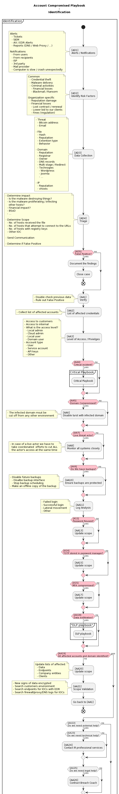

# Account Compromised Playbook

- [Account Compromised Playbook](#account-compromised-playbook)
  - [Metadata](#metadata)
  - [Identification](#identification)
  - [Containment & Eradication](#containment--eradication)
  - [Recovery](#recovery)
  - [Lessons Learnt](#lessons-learnt)

---

## Metadata

| Basic Information ||
| --- | --- |
| **Playbook Name** | Account Compromised Playbook |
| **Short name** | AC |
| **Last update** | 16 April 2022 |
| **Version** | 1.0 |

| Notation ||
| --- | --- |
| **AD** | Account Compromised Identification |
| **AA** | Account Compromised Verification |
| **AC** | Account Compromised Containment |
| **RC** | Account Compromised Eradication |
| **AR** | Account Compromised Recovery |
| **AP** | Account Compromised Lessons Learnt |

---

## Identification

  

---

## Containment & Eradication

  

---

## Recovery

  

---

## Lessons Learnt

  

---