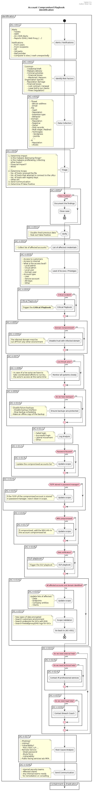
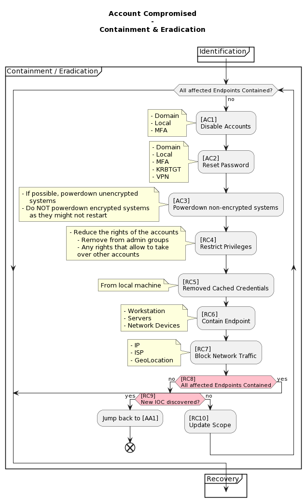
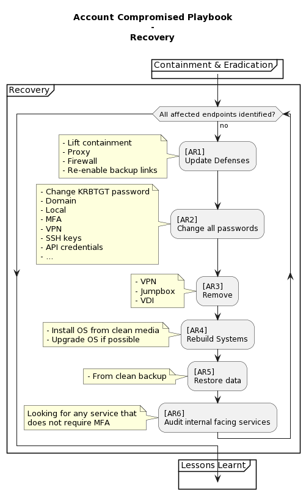
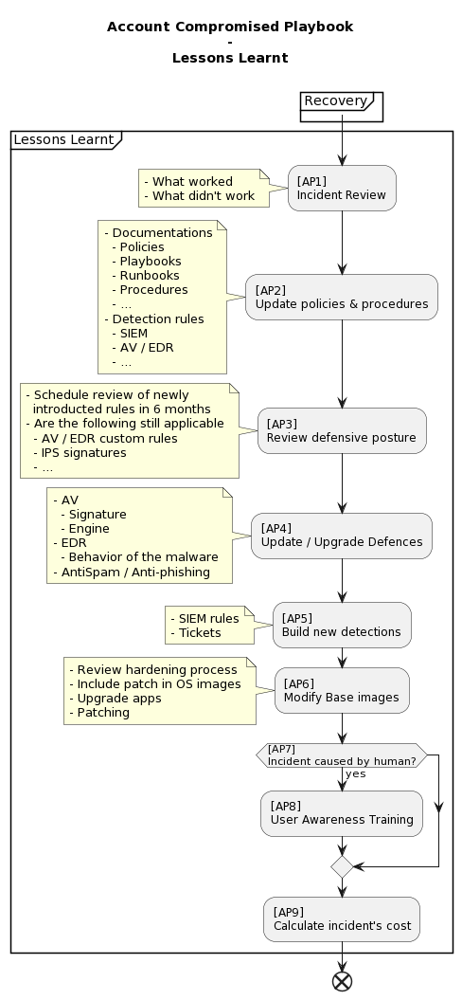

# Account Compromised Playbook

- [Account Compromised Playbook](#account-compromised-playbook)
  - [Metadata](#metadata)
  - [Identification](#identification)
  - [Containment & Eradication](#containment--eradication)
  - [Recovery](#recovery)
  - [Lessons Learnt](#lessons-learnt)

---

## Metadata

| Basic Information ||
| --- | --- |
| **Playbook Name** | Account Compromised Playbook |
| **Short name** | AC |
| **Last update** | 16 April 2022 |
| **Version** | 1.0 |

| Notation ||
| --- | --- |
| **AC-I** | Account Compromised Identification |
| **AC-V** | Account Compromised Verification |
| **AC** | Account Compromised Containment |
| **RC** | Account Compromised Eradication |
| **AR** | Account Compromised Recovery |
| **AP** | Account Compromised Lessons Learnt |

---

## Identification

  

| **Step Code** | **Type** | **Step Name** | **Explanation** |
| --- | --- | --- | --- |
| **Identification** ||
| **AC-I-001** | Input |Alerts / Notifications | Inputs of the identification workflow |
| **AC-I-002** | Action | Identify Risk Factors | Common or Organization specific risk factors |
| **AC-I-003** | Action | Data Collection | Data enrichment related to the information. Like Threat, File, Domain and IP |
| **AC-I-004** | Action | Triage | Identify if this is a False Postive.  If true, determine the impact and scope, as well as the communication required. |
| **AC-I-005** | Condition | False Positive? | Determine if this is a false positive |
| **Verification** ||
| **AC-V-001** | Action | Verify | Double check the data collected and rule out false positive |
| **AC-V-002** | Action | List of affected credentials | Find out all of the affected credentials and accounts |
| **AC-V-003** | Action | Level of Access / Privileges | For each account, find out the level of access and the privileges |
| **AC-V-004** | Condition | Critical Incident? | Determine if this is a critical incident. If true, have to trigger the **Critical Playbook** in parallel |
| **AC-V-005** | Condition | Domain Compromised? | Determine if there is a domain compromise |
| **AC-V-006** | Action | Disable trust with infected domain | As a containment, disable the trust with the infected domain |
| **AC-V-007** | Condition | Live threat actor? | Determine if there is any threat actor in the network live |
| **AC-V-008** | Action | Monitor all systems closely | In case of a live actor we have to take coordonated efforts to cut ALL the actor's access at the same time |
| **AC-V-009** | Condition | Do we have backups? | Determine if we have backups on the affected systems |
| **AC-V-010** | Action | Ensure backups are protected | Since you will have to use the good backups to restore systems, we need to protect them well |
| **AC-V-011** | Action | Log Analysis | Check the related logs to identify more surrounding information |
| **AC-V-012** | Condition | Password reused? | Determine if there is any account reusing the same compromised accounts' password |
| **AC-V-013** | Action | Update scope | Update the compromised accounts list |
| **AC-V-014** | Condition | TOTP stored in password manager? | Check if the TOTP of the compromised accounts are in the password manager |
| **AC-V-015** | Action | Update scope | If the TOTP of the compromised account is stored in password manager, note it down in scope. |
| **AC-V-016** | Condition | MFA compromised | Determine if the MFA is compromised |
| **AC-V-017** | Action | Update scope | If the MFA is compromised, add the MFA info to the account compromised list |
| **AC-V-018** | Condition & Action | If identified data exfiltration, trigger the DLP playbook | **AC-V-019** | Condition | All affected accounts and domain identified? | Determine if all affected accounts and domains are identified |
| **AC-V-020** | Action | Update Scope | Update lists of affected data / endpoints / entities / clients |
| **AC-V-021** | Action | Scope validation | Add additional info into scoping |
| **AC-V-022** | Condition | Do we need external help? | Determine if extra help is needed |
| **AC-V-023** | Condition | (Do we need technical help? | Determine if extra help on technical is needed |
| **AC-V-024** | Action | Contact IR professional services | / |
| **AC-V-025** | Condition | Do we need legal help? | Determine if legal help is requried |
| **AC-V-026** | Action | Contact Breach Coach | / |
| **AC-V-027** | Action | Root Cause Analysis | Determine the initial compromise cause |
| **AC-V-028** | Action | Send Communication | Formulation of IR team, notifications, etc. |

---

## Containment & Eradication

  

---

## Recovery

  

---

## Lessons Learnt

  

---